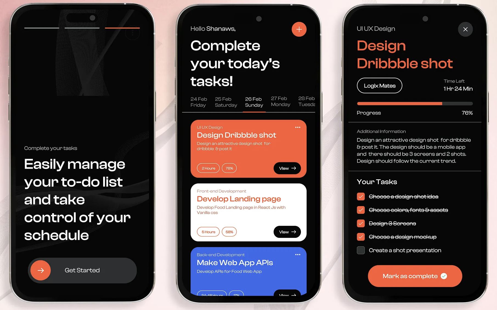

# My First App Using AI (Codex)



## Overview
`ai-todo-app` is a multi-module Android Todo application built with Kotlin and Jetpack Compose.

The app currently includes:
- Onboarding screen with slide-to-start interaction
- Dashboard screen with task cards
- Task detail screen with progress and checklist
- Edge-to-edge safe UI handling for status/navigation bars

## Architecture
The project is organized for scale with clear module boundaries:

- `app`: Android app entry point and NavHost setup
- `core:designsystem`: app theme, colors, and typography
- `core:navigation`: route definitions
- `feature:todo`: Todo UI/presentation + screen graph
- `feature:todo:domain`: domain models, repository contract, use cases
- `feature:todo:data`: data layer (in-memory repository)

## Tech Stack
- Kotlin
- Jetpack Compose (Material 3)
- Android Gradle Plugin 9
- Gradle Kotlin DSL

## Current Functionality
- Navigate through 3 main screens:
  - Intro
  - Dashboard
  - Detail
- Add quick tasks from dashboard (`+` action)
- Open task details from dashboard cards
- Mark tasks complete from detail screen
- Live updates reflected across screens

## Project Structure
```text
ai-todo-app/
  app/
  core/
    designsystem/
    navigation/
  feature/
    todo/
      data/
      domain/
```

## Getting Started
### Prerequisites
- Android Studio (latest stable recommended)
- JDK 11+

### Run
1. Open the project in Android Studio.
2. Sync Gradle.
3. Run the `app` module on emulator/device.

Or via terminal:
```bash
./gradlew :app:assembleDebug
```

## Roadmap
- Persist tasks with Room
- Add create/edit task form flow
- Add more feature modules (settings/profile)
- Add unit and UI tests

